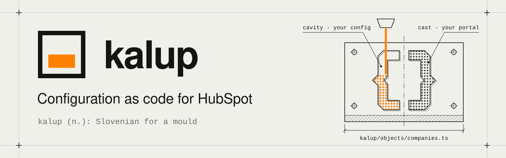
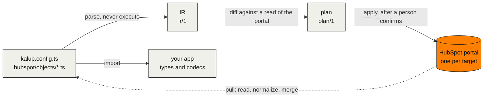

<p align="center">
  <picture>
    <source media="(prefers-color-scheme: dark)" srcset=".github/assets/banner-dark.svg">
    <source media="(prefers-color-scheme: light)" srcset=".github/assets/banner-light.svg">
    
  </picture>
</p>

<p align="center">
  <b>Keep a HubSpot portal's configuration in TypeScript files, review every change as a diff, apply it to any portal, and give your app its types from the same files.</b>
</p>

<p align="center">
  <a href="https://github.com/scopiousdigital/kalup/actions/workflows/ci.yml"></a>
  <a href="LICENSE"></a>
  <a href="https://www.npmjs.com/package/kalup"></a>
  <a href=".nvmrc"></a>
  <a href="https://www.ultracite.ai"></a>
</p>

<p align="center">
  <a href="https://kalup.dev/docs"><b>Docs</b></a>
  &nbsp;·&nbsp;
  <a href="#getting-started"><b>Getting started</b></a>
  &nbsp;·&nbsp;
  <a href="docs/architecture.md"><b>Architecture</b></a>
  &nbsp;·&nbsp;
  <a href="#roadmap"><b>Roadmap</b></a>
  &nbsp;·&nbsp;
  <a href="CONTRIBUTING.md"><b>Contributing</b></a>
</p>

> [!NOTE]
> Kalup reads and writes properties and property groups on standard and custom objects. Custom object schemas are read and compared, not written. Pipelines, custom object schema writes and association labels are next ([Roadmap](#roadmap)). The pull, plan, apply and drift workflow passed [live runs](docs/hubspot.md#live-runs) on a HubSpot developer test account. Start on a test account or sandbox. Before 1.0, a minor release may change the config grammar or the JSON output, and its release notes say so.

## Why Kalup

HubSpot portals are configured by hand in the UI, and nothing records why. HubSpot's own tools, including its agent CLI and MCP tools, change a portal in place, with no file, no diff and no plan a person approved. Kalup is the layer above them:

- **Changes are reviewed as diffs.** Properties, groups and custom objects live in git, and a change is a pull request with a plan attached, whether a person or an AI agent made it.
- **One config, any portal.** A project names its targets (`sandbox`, `production`, a client's portal) and the same files apply to each.
- **Drift is held, not reverted.** People keep editing in the HubSpot UI; Kalup reports the difference and never overwrites it unless you say so. Absence never deletes.
- **The same files type your app**, with no generate step. The tool parses them and never executes them, so an agent can edit them safely.

## What it looks like

`hubspot/objects/companies.ts`:

```ts
import { defineObject, type InferProperties, p } from '@kalup/core'

export const Company = defineObject('companies', {
  groups: {
    billing: { label: 'Billing' },
  },
  properties: {
    // Set by the billing sync. Do not edit by hand.
    billingStatus: p.enum('billing_status', {
      label: 'Billing status',
      group: 'billing',
      fieldType: 'select',
      options: [
        { value: 'active', label: 'Active' },
        { value: 'PAST DUE', label: 'Past due', as: 'past_due' },
        { value: 'cancelled', label: 'Cancelled' },
      ],
    }),
    // HubSpot-defined: no definition, so Kalup reads it and never writes it.
    domain: p.string('domain'),
    name: p.string('name'),
    renewalDate: p.date('renewal_date', {
      label: 'Renewal date',
      group: 'billing',
      fieldType: 'date',
    }),
    seatCount: p.number('seat_count', {
      label: 'Seat count',
      group: 'billing',
      fieldType: 'number',
    }),
  },
})

export type CompanyData = InferProperties<typeof Company.properties> & { id: string }
```

The tool parses this file and writes it back in one canonical form. It never executes it. Your app imports it, and `CompanyData` is typed from it with no build step: `CompanyData['billingStatus']` is `'active' | 'past_due' | 'cancelled' | Unlisted | null`, where `Unlisted` is an option HubSpot holds that the file does not list yet (`.strict()` throws on one instead).

```ts
import { Company } from './hubspot/index.js' // a bundler also resolves './hubspot'

Company.properties.billingStatus.get(record.properties) // 'past_due' when HubSpot stores 'PAST DUE'
Company.properties.billingStatus.set(update, 'past_due') // writes 'PAST DUE' into the property bag
Company.properties.renewalDate.clear(update) // writes '', which HubSpot reads as a clear
```

Checking the files, in [`examples/basic`](examples/basic):

```console
$ pnpm exec kalup validate
Config valid (0 errors, 0 warnings)
$ pnpm exec kalup ir --check
$ pnpm exec kalup fmt --check
All files are canonical
```

A mistake names the file, the line and the fix, and exits 3. This is the same example with one group name changed:

```console
$ pnpm exec kalup validate
Config invalid (1 error, 0 warnings)
hubspot/objects/companies.ts:33: E_UNKNOWN_GROUP: group 'licensing' is not in the groups of companies (fix: add licensing: { label: '...' } to the groups block) (docs: errors/E_UNKNOWN_GROUP.md)
```

Example output of `pull`, run against the example's fake portal after someone renamed a label in the HubSpot UI and a property existed in the portal but not yet in the file:

```console
$ pnpm exec kalup pull --target sandbox
Target sandbox, portal 1111111
companies: 1 added, 1 changed, 5 unchanged, 0 missing in portal
  changed: property:companies/billing_status#label "Billing status" -> "Billing state"
  added: property:companies/renewal_date
subscription: 0 added, 0 changed, 6 unchanged, 0 missing in portal
wrote hubspot/objects/companies.ts
Recorded the agreed values of 11 resources in state
State for portal 1111111 is new: .kalup/state/portal-1111111.json
```

`pull` takes the portal's side of drift, keeps config's side of a conflict unless `--accept` names it, keeps your keys, aliases, comments and `.required()` calls, and copies every file it overwrites to `.kalup/history/` first. It then records in state what the files and the portal agree on, so your next edit to a file is a change the plan writes, not a difference it holds.

## How it works



Two versioned JSON documents hold the system together. The IR (`ir/1`) is what the config files mean. The plan (`plan/1`) is what `apply` would do to one target. Everything else (docs, the typed client, AI agents) reads the IR or the plan and never the TypeScript. `pull` is the reverse arrow: it reads a target and merges what it finds into the files. `apply` writes properties and property groups, and a small state file per portal records what it last applied, so a plan can tell your change from an edit someone made in the HubSpot UI. The full contract is in [docs/architecture.md](docs/architecture.md).

## Commands

The commands `kalup --help` lists, in the order you meet them.

| Command | What it does |
|---|---|
| `kalup init` | Create kalup.config.ts and the project files. Offline: no key, no request. |
| `kalup pull` | Read a target and write the object files. |
| `kalup validate` | Check the config files and report every issue. |
| `kalup ir` | Print the IR document derived from the config files. |
| `kalup fmt` | Rewrite config files in canonical form. |
| `kalup status` | Show targets, portal checks and state. |
| `kalup compare` | Compare two sides: what would change in B to match A. |
| `kalup plan` | Show what apply would change on a target. |
| `kalup snapshot` | Save a read of a target as a snapshot file. |
| `kalup docs` | Write a Markdown data dictionary of the config or a snapshot. |
| `kalup apply` | Apply a saved plan, or plan a target and apply it in one run after a person at a terminal confirms it. |
| `kalup rm` | Take a property or group out of config and write its tombstone in removed.ts. |
| `kalup state rebuild` | Report what a target's portal holds against its state; --write replaces the state file. |
| `kalup target rebind` | Point a target at a recreated test portal or sandbox. A terminal only. |
| `kalup add` | Write a blueprint from a JSON file or https URL into the config files. Never touches a portal. |
| `kalup blueprint upgrade` | Merge a new version of an added blueprint into the config files. Never touches a portal. |

Every command but `apply` only reads a portal. `apply` writes properties and property groups after one approval: a person at a terminal who types the target name, `--yes` for a small safe change on an unprotected target, or `--approve` from a reviewed CI job. Every delete needs the person. The loop for one change:

```sh
npx kalup init --portal <portal-id> --target sandbox  # writes kalup.config.ts, hubspot/ and AGENTS.md; sends nothing
npx kalup pull                       # write the object files; after an edit in the HubSpot UI, bring them up to date
npx kalup compare sandbox config     # what differs between a target and config, or two targets
npx kalup plan                       # every change, classified, with held drift listed
npx kalup apply                      # plan again and write, after a person confirms at a terminal
```

The loop uses the one target `init` wrote, here `sandbox`. With a second target, `compare sandbox production` and `plan --target production` work the same way: see [Sandbox, production and CI](https://kalup.dev/docs/guides/several-portals).

<details>
<summary><b>Options and exit codes</b></summary>

| Option | What it does |
|---|---|
| `--json` | Print one `envelope/1` document to stdout and nothing else (every command) |
| `--target <name>` | The target to run against, for a command that reads one; by default `defaultTarget`, else the only target |
| `--check` | Report what would change and write nothing (`fmt`, `pull`); `ir --check` validates and prints only issues |
| `--exit-code` | Exit 2 on a difference (`pull --check`, `compare`; `fmt --check` always does), anything pending (`plan`) or a held conflict (`blueprint upgrade`) |
| `--out <file>` | Write the plan, the snapshot or the data dictionary to this file (`plan`, `snapshot`, `docs`); `plan --out` alone writes `.kalup/plans/<target>-<planId>.json` |
| `--take config <address[#unit]>` | Take config's side of a held value; the address may hold `*` (`plan`, `apply`) |
| `--yes` | Approve a small safe apply on an unprotected target without a prompt (`apply`) |
| `--approve <writesHash>` | A reviewed CI job's approval of a saved plan; never covers a delete (`apply`) |
| `--help` | Print the help, for one command when you name it |
| `--version` | Print the version |

Each command accepts only its own flags; any other flag is a usage error (exit 1). `kalup <command> --help` lists them.

| Exit code | Meaning |
|---|---|
| 0 | Done |
| 1 | Error |
| 2 | Differences pending, only with `--exit-code` |
| 3 | Config or IR invalid |
| 4 | A person is needed, for example when the key belongs to a portal other than the pinned one |
| 5 | Partial apply: run `plan` again |

</details>

## Packages

| Package | Path | What it is | Status |
|---|---|---|---|
| `kalup` | [`packages/cli`](packages/cli) | The CLI, bin `kalup`, and the JSON Schemas of its documents as `kalup/schemas/<file>` | Released |
| `@kalup/core` | [`packages/core`](packages/core) | What your files and app import: property codecs, `InferProperties`, and `defineConfig` and `defineRemoved` with their types. Zero runtime dependencies, no HTTP | Released |
| `@kalup/client` | none yet | A typed CRM client built on the same files | Later |

## Kalup and HubSpot's own tools

Kalup works next to HubSpot's own tools and calls HubSpot's public REST APIs directly.

- **The HubSpot Agent CLI and the MCP configuration tools** let an agent create, update and delete properties, pipelines and more from a prompt. They have no desired-state file, no diff against a portal, no plan over a whole change set, no targets and no drift detection. After a quick change with them, run `kalup pull` so the files catch up.
- **Sandbox deploy to production** is Enterprise only, moves new assets only and cannot push an edit to anything that already exists. Kalup's `compare` and `plan` work between any two portals, including edits, and `apply` writes property and group changes to any target you name.
- **The `hs` CLI and the projects framework** are configuration as code for apps and CMS assets. Kalup does not rebuild any of that. Use `hs` for the app and Kalup for the portal.

## Roadmap

The order is the promise. The calendar is not.

- **Released**: every command above, for properties and property groups on standard and custom objects, with every writable property definition field. Custom object schemas are read and compared, not written. The object files in a folder you choose (`hubspot/` by default), an offline `init`, `apply` that plans and asks in one step on every target, state shared through the repository with `state: 'repo'`, monorepos, takeover mode, `exclude`, `adopt`, `yesLimit`, lenient enums, blueprints and per-target overrides.
- **Next**: pipelines and stages, then custom object schema writes, then association labels. Each ships with live evidence and recovery tests.
- **Later**: a hosted service for agencies with shared state, scheduled snapshots, approvals and history, running the same engine. Then lists, forms, workflows and the typed record client.

The design behind this is in [docs/architecture.md](docs/architecture.md).

## Getting started

You need Node 22.13.1 or later, the portal's Hub ID (from the account menu in HubSpot), and a Super Admin to create a service key.

**1. Install** both packages in your project. `@kalup/core` is what the config files and your app import; `kalup` is the CLI.

```sh
npm install @kalup/core
npm install -D kalup
```

With pnpm, yarn or bun: `pnpm add @kalup/core && pnpm add -D kalup`, and the same with `yarn add` or `bun add`. Your app imports `@kalup/core` at run time (7 kB, no dependencies), so it is a regular dependency. The `kalup` CLI is a dev tool. If you skip the first line, `kalup init` adds `@kalup/core` to `package.json` for you.

**2. Create a service key** in HubSpot under Development > Keys > Service keys ([HubSpot's guide](https://developers.hubspot.com/docs/apps/developer-platform/build-apps/authentication/account-service-keys)). Give it `crm.schemas.<object>.read` for each object you manage (contacts, companies and deals by default), the matching `crm.schemas.<object>.write` scopes if you will apply changes, and one `crm.objects.<object>.read` so `plan` can check HubSpot's property limit. `init` prints the exact list. Put the key in `.env`:

```sh
HUBSPOT_SERVICE_KEY=<your key>
```

**3. Pull the portal into files:**

```sh
npx kalup init --portal <portal-id>
npx kalup pull
```

`init` sends nothing to HubSpot and needs no key. It writes `kalup.config.ts` with one target pinned to that portal (`--portal` can wait: the target is then pending until you set `portalId`), `hubspot/`, the `.kalup/` and `.env` lines in `.gitignore`, `AGENTS.md` with the rules an AI agent follows in the project, a `CLAUDE.md` that points at it, and `@kalup/core` in `dependencies` in `package.json` when no dependency list has it. In a monorepo it edits the `.gitignore` and formatter config it finds up to the repository root. `init` does not run the install: when it adds `@kalup/core`, run your package manager's install afterwards. `pull` reads the account behind the key first and stops with exit 4 if it is not that portal. Otherwise it writes the object files and records in state what they and the portal agree on. Nothing is written to the portal.

<details>
<summary><b>Example output of <code>init</code></b></summary>

Run against the example's fake portal, a sandbox account with a billing group on companies, with the scope narrowed to companies. The default scope also lists the contacts and deals scopes and a summary line for each.

```console
$ pnpm exec kalup init --portal 1111111 --objects companies --target sandbox
Target sandbox, portal 1111111: companies
wrote kalup.config.ts
wrote hubspot/index.ts
wrote .gitignore
wrote AGENTS.md
wrote CLAUDE.md
No biome.json or prettier config found. If you add a formatter, ignore hubspot/ and kalup.config.ts in it: the writer keeps those files in its own format.
Read scopes the key in HUBSPOT_SERVICE_KEY needs (Development > Keys > Service keys, see https://developers.hubspot.com/docs/apps/developer-platform/build-apps/authentication/account-service-keys):
  crm.schemas.companies.read (companies)
  crm.objects.companies.read (recommended, for the property limit check in plan; kalup reads no records)
For apply, the write key needs the read scopes and:
  crm.schemas.companies.write (companies)
Next:
  Run npx kalup pull to write the object files from the portal.
$ pnpm exec kalup pull
Target sandbox, portal 1111111 (the only target)
companies: 5 added, 0 changed, 0 unchanged, 0 missing in portal
  added: property:companies/billing_notes
  added: property:companies/billing_status
  added: property:companies/renewal_date
  added: property:companies/seat_count
  added: group:companies/billing
wrote hubspot/index.ts
wrote hubspot/objects/companies.ts
Recorded the agreed values of 5 resources in state
State for portal 1111111 is new: .kalup/state/portal-1111111.json
```

</details>

**4. Edit, plan, apply.** Change a label or add a property in `hubspot/objects/*.ts`, then:

```sh
npx kalup plan    # review every step
npx kalup apply   # plans again, prints the plan, and you type the target name to confirm
```

To review a plan before you apply it, or to hand it to CI, save it with `npx kalup plan --out` and apply the file it names.

Commit `kalup.config.ts` and everything under `hubspot/`. Keep `.kalup/` (local state, history, saved plans), plan files and `.env` out of git: `init` adds the ignore lines. To share state with your team, set `state: 'repo'` in `kalup.config.ts`, move any `.kalup/state/portal-<id>.json` you have into `hubspot/state/`, and commit `hubspot/state/` too.

The first plan also adopts what you pulled, so Kalup knows it manages those properties. Nothing else in the portal changes.

### Guides

Each guide is a complete path with the exact commands, and a test replays their `npx kalup` lines against a simulated portal.

- **[One admin, one portal](https://kalup.dev/docs/guides/one-portal)**, alone or with an AI agent: the first plan and apply, an edit made in the HubSpot UI held as drift, and an apply that stopped part way.
- **[Sandbox, production and CI](https://kalup.dev/docs/guides/several-portals)**, for a developer: two targets, separate read and write keys, `compare`, `apply --yes` on the sandbox, and production through a reviewed CI job with `--approve`. The CI workflow has not run in a real CI yet.
- **[Agencies and blueprints](https://kalup.dev/docs/guides/blueprints-for-agencies)**: one repository per client, a shared blueprint, per-target overrides, rolling out onto a portal that already has the properties, takeover, and upgrades across clients.

The reference docs are at [kalup.dev/docs](https://kalup.dev/docs), and ship offline in the package under [`node_modules/kalup/docs`](packages/cli/docs).

To try Kalup without a HubSpot account, or to work on it, build it from source: see [CONTRIBUTING.md](CONTRIBUTING.md).

## Contributing

Pull requests are welcome. Read [CONTRIBUTING.md](CONTRIBUTING.md) first: it covers the setup, the house rules and the DCO sign-off (`git commit -s`). Questions go to [GitHub Discussions](https://github.com/scopiousdigital/kalup/discussions), bugs to [issues](https://github.com/scopiousdigital/kalup/issues/new/choose), and security problems through [private reporting](SECURITY.md), never a public issue. Everyone taking part follows the [Code of Conduct](CODE_OF_CONDUCT.md). See [SUPPORT.md](SUPPORT.md) for where to ask what. If you are an AI agent working in this repo, read [`AGENTS.md`](AGENTS.md) first.

## Licence

Apache-2.0. See [`LICENSE`](LICENSE) and [`NOTICE`](NOTICE).

> Everything that runs on your machine or in your CI against HubSpot's public APIs is free and stays free. The licence will not tighten.

Blueprint content, when it exists, will carry its own permissive licence (MIT or 0BSD) so copied files carry no notice obligations into your repo.

Built by [Scopious](https://scopious.dev). A hosted service for teams is planned.

---

<sub>Kalup is an independent open-source project maintained by Scopious. It is not affiliated with, endorsed by, or sponsored by HubSpot, Inc. HubSpot is a registered trademark of HubSpot, Inc.</sub>
