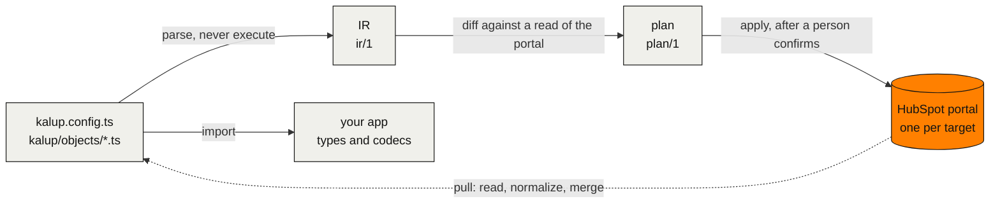

<p align="center">
  <picture>
    <source media="(prefers-color-scheme: dark)" srcset=".github/assets/banner-dark.svg">
    <source media="(prefers-color-scheme: light)" srcset=".github/assets/banner-light.svg">
    
  </picture>
</p>

<p align="center">
  <b>Keep a HubSpot portal's configuration in TypeScript files, review every change as a diff, apply it to any portal, and give your app its types from the same files.</b>
</p>

<p align="center">
  <a href="https://github.com/scopiousdigital/kalup/actions/workflows/ci.yml"></a>
  <a href="LICENSE"></a>
  <a href="#roadmap"></a>
  <a href=".nvmrc"></a>
  <a href="https://www.ultracite.ai"></a>
</p>

<p align="center">
  <a href="packages/cli/docs/"><b>Docs</b></a>
  &nbsp;·&nbsp;
  <a href="#getting-started"><b>Getting started</b></a>
  &nbsp;·&nbsp;
  <a href="docs/architecture.md"><b>Architecture</b></a>
  &nbsp;·&nbsp;
  <a href="#roadmap"><b>Roadmap</b></a>
  &nbsp;·&nbsp;
  <a href="CONTRIBUTING.md"><b>Contributing</b></a>
</p>

> [!NOTE]
> **Status: pre-alpha, working toward 0.1.0.** Every command below is implemented with offline tests. Two [live HubSpot runs](docs/hubspot.md#live-runs) on a developer test account passed the pull, plan, apply and drift workflow. A stale-lock race and the remaining conformance checks still block the release. Run Kalup from a source checkout ([Getting started](#getting-started)); the packages are at 0.0.0.

## Why Kalup

HubSpot portals are configured by hand in the UI, and nothing records why. HubSpot's own tools, including its agent CLI and MCP tools, change a portal in place, with no file, no diff and no plan a person approved. Kalup is the layer above them:

- **Changes are reviewed as diffs.** Properties, groups and custom objects live in git, and a change is a pull request with a plan attached, whether a person or an AI agent made it.
- **One config, any portal.** A project names its targets (`sandbox`, `production`, a client's portal) and the same files apply to each.
- **Drift is held, not reverted.** People keep editing in the HubSpot UI; Kalup reports the difference and never overwrites it unless you say so. Absence never deletes.
- **The same files type your app**, with no generate step. The tool parses them and never executes them, so an agent can edit them safely.

## What it looks like

`kalup/objects/companies.ts`:

```ts
import { defineObject, type InferProperties, p } from '@kalup/core'

export const Company = defineObject('companies', {
  groups: {
    billing: { label: 'Billing' },
  },
  properties: {
    // Set by the billing sync. Do not edit by hand.
    billingStatus: p.enum('billing_status', {
      label: 'Billing status',
      group: 'billing',
      fieldType: 'select',
      options: [
        { value: 'active', label: 'Active' },
        { value: 'PAST DUE', label: 'Past due', as: 'past_due' },
        { value: 'cancelled', label: 'Cancelled' },
      ],
    }),
    // HubSpot-defined: no definition, so Kalup reads it and never writes it.
    domain: p.string('domain'),
    name: p.string('name'),
    renewalDate: p.date('renewal_date', {
      label: 'Renewal date',
      group: 'billing',
      fieldType: 'date',
    }),
    seatCount: p.number('seat_count', {
      label: 'Seat count',
      group: 'billing',
      fieldType: 'number',
    }),
  },
})

export type CompanyData = InferProperties<typeof Company.properties> & { id: string }
```

The tool parses this file and writes it back in one canonical form. It never executes it. Your app imports it, and `CompanyData` is typed from it with no build step: `CompanyData['billingStatus']` is `'active' | 'past_due' | 'cancelled' | null`.

```ts
import { Company } from './kalup'

Company.properties.billingStatus.get(record.properties) // 'past_due' when HubSpot stores 'PAST DUE'
Company.properties.billingStatus.set(update, 'past_due') // writes 'PAST DUE' into the property bag
```

Checking the files, in [`examples/basic`](examples/basic):

```console
$ pnpm exec kalup validate
Config valid (0 errors, 0 warnings)
$ pnpm exec kalup ir --check
$ pnpm exec kalup fmt --check
All files are canonical
```

A mistake names the file, the line and the fix, and exits 3. This is the same example with one group name changed:

```console
$ pnpm exec kalup validate
Config invalid (1 error, 0 warnings)
kalup/objects/companies.ts:33: E_UNKNOWN_GROUP: group 'licensing' is not in the groups of companies (fix: add licensing: { label: '...' } to the groups block) (docs: errors/E_UNKNOWN_GROUP.md)
```

Example output of `pull`, run against the example's fake portal after someone renamed a label in the HubSpot UI and a property existed in the portal but not yet in the file:

```console
$ pnpm exec kalup pull --target sandbox
Target sandbox, portal 1111111
companies: 1 added, 1 changed, 5 unchanged, 0 missing in portal
  changed: property:companies/billing_status#label "Billing status" -> "Billing state"
  added: property:companies/renewal_date
subscription: 0 added, 0 changed, 6 unchanged, 0 missing in portal
wrote kalup/objects/companies.ts
```

`pull` takes the portal's side of drift, keeps config's side of a conflict unless `--accept` names it, keeps your keys, aliases, comments and `.required()` calls, and copies every file it overwrites to `.kalup/history/` first.

## How it works



Two versioned JSON documents hold the system together. The IR (`ir/1`) is what the config files mean. The plan (`plan/1`) is what `apply` would do to one target. Everything else (docs, the typed client, AI agents) reads the IR or the plan and never the TypeScript. `pull` is the reverse arrow: it reads a target and merges what it finds into the files. `apply` writes properties and property groups, and a small state file per portal records what it last applied, so a plan can tell your change from an edit someone made in the HubSpot UI. The full contract is in [docs/architecture.md](docs/architecture.md).

## Commands

The commands `kalup --help` lists, in the order you meet them. Each is implemented and verified offline; none is released.

| Command | What it does | Milestone |
|---|---|---|
| `kalup init` | Create kalup.config.ts and pull the first target. | 1 |
| `kalup pull` | Read a target and write kalup/objects/*.ts. | 1 |
| `kalup validate` | Check the config files and report every issue. | 1 |
| `kalup ir` | Print the IR document derived from the config files. | 1 |
| `kalup fmt` | Rewrite config files in canonical form. | 1 |
| `kalup status` | Show targets, portal checks and state. | 1 |
| `kalup compare` | Compare two sides: what would change in B to match A. | 2 |
| `kalup plan` | Show what apply would change on a target. | 2 |
| `kalup snapshot` | Save a read of a target as a snapshot file. | 2 |
| `kalup docs` | Write a Markdown data dictionary of the config or a snapshot. | 2 |
| `kalup apply` | Apply a saved plan to its target, or plan and apply an unprotected target in one run. | 3 |
| `kalup rm` | Take a property or group out of config and write its tombstone in kalup/removed.ts. | 3 |
| `kalup state rebuild` | Report what a target's portal holds against its state; --write replaces the state file. | 3 |
| `kalup target rebind` | Point a target at a recreated test portal or sandbox. A terminal only. | 3 |
| `kalup add` | Write a blueprint from a JSON file or https URL into the config files. Never touches a portal. | 4 |
| `kalup blueprint upgrade` | Merge a new version of an added blueprint into the config files. Never touches a portal. | 4 |

Every command but `apply` only reads a portal. `apply` writes properties and property groups after one approval: a person at a terminal who types the target name, `--yes` for a small safe change on an unprotected target, or `--approve` from a reviewed CI job. Every delete needs the person. The loop for one change:

```sh
kalup init --portal <portal-id>                 # writes kalup.config.ts, kalup/ and AGENTS.md
kalup pull                                      # read a target, write kalup/objects/*.ts
kalup compare sandbox production                # what differs between two targets, or a target and config
kalup plan --target production --out plan.json  # every change, classified, with held drift listed
kalup apply plan.json                           # write, after a person confirms at a terminal
```

<details>
<summary><b>Options and exit codes</b></summary>

| Option | What it does |
|---|---|
| `--json` | Print one `envelope/1` document to stdout and nothing else (every command) |
| `--target <name>` | The target to run against, for a command that reads one; by default `defaultTarget`, else the only target |
| `--check` | Report what would change and write nothing (`fmt`, `pull`); `ir --check` validates and prints only issues |
| `--exit-code` | Exit 2 on a difference (`fmt --check`, `pull --check`, `compare`) or a held conflict (`blueprint upgrade`) |
| `--out <file>` | Write the plan, the snapshot or the data dictionary to this file (`plan`, `snapshot`, `docs`) |
| `--take config <address[#unit]>` | Take config's side of a held unit (`plan`, `apply`) |
| `--yes` | Approve a small safe apply on an unprotected target without a prompt (`apply`) |
| `--approve <writesHash>` | A reviewed CI job's approval of a saved plan; never covers a delete (`apply`) |
| `--help` | Print the help, for one command when you name it |
| `--version` | Print the version |

Each command accepts only its own flags; any other flag is a usage error (exit 1). `kalup <command> --help` lists them.

| Exit code | Meaning |
|---|---|
| 0 | Done |
| 1 | Error |
| 2 | Differences pending, only with `--exit-code` |
| 3 | Config or IR invalid |
| 4 | A person is needed, for example when the key belongs to a portal other than the pinned one |
| 5 | Partial apply: run `plan` again |

</details>

## Packages

| Package | Path | What it is | Status |
|---|---|---|---|
| `kalup` | [`packages/cli`](packages/cli) | The CLI, bin `kalup`. Also exports `defineConfig`, `defineRemoved` and the `KalupConfig` type for `kalup.config.ts` and `kalup/removed.ts` | Implemented, not on npm |
| `@kalup/core` | [`packages/core`](packages/core) | The runtime: property codecs, `InferProperties`, the config reader and writer, the IR, plan, state and blueprint schemas. Zero runtime dependencies, no HTTP | Implemented, not on npm |
| `@kalup/client` | none yet | A typed CRM client built on the same files | Deferred; no assigned milestone |

## Kalup and HubSpot's own tools

Kalup works next to HubSpot's own tools and calls HubSpot's public REST APIs directly.

- **The HubSpot Agent CLI and the MCP configuration tools** let an agent create, update and delete properties, pipelines and more from a prompt. They have no desired-state file, no diff against a portal, no plan over a whole change set, no targets and no drift detection. After a quick change with them, run `kalup pull` so the files catch up.
- **Sandbox deploy to production** is Enterprise only, moves new assets only and cannot push an edit to anything that already exists. Kalup's `compare` and `plan` work between any two portals, including edits, and `apply` writes property and group changes to any target you name.
- **The `hs` CLI and the projects framework** are configuration as code for apps and CMS assets. Kalup does not rebuild any of that. Use `hs` for the app and Kalup for the portal.

## Roadmap

The order is the promise. The calendar is not.

1. **0.1.0**: everything in the command table for properties, property groups and custom object schemas (read and compared, not written), plus takeover mode, per-object `exclude`, lenient enums and `@kalup/core` as the single import for config and app. Release gates: the stale-lock fix, the remaining live conformance checks and a real CI run of the documented recipe.
2. **Pipelines and stages.**
3. **Custom object schema writes.**
4. **Association labels.**
5. **A hosted service** for agencies: shared state, scheduled snapshots, approvals and history, running the same engine.

The design behind this is in [docs/architecture.md](docs/architecture.md).

## Getting started

Kalup is not on npm yet, so run it from a checkout. Kalup runs on Node 22.13.1 or later; building it from source needs Node 22.18 or later, which its build tool requires, and pnpm.

### Build from source

```sh
git clone https://github.com/scopiousdigital/kalup.git
cd kalup
pnpm install
pnpm build
node packages/cli/dist/index.mjs --help
```

### Try it on the example

The example project needs no HubSpot account for these commands. `pnpm install` links the `kalup` bin into it, and the bin runs the build from `pnpm build`:

```sh
cd examples/basic
pnpm exec kalup validate
pnpm exec kalup ir
```

### Point it at a portal

You need the portal's Hub ID and a service key with the read scopes of the objects you manage, plus their write scopes if you will apply changes. In your project directory, install both packages from the checkout: `kalup` gives you the CLI and the types for `kalup.config.ts`, and `@kalup/core` is what the files under `kalup/` and your app import.

```sh
npm init -y   # only if the directory has no package.json yet
npm install <path-to-kalup>/packages/cli <path-to-kalup>/packages/core
```

Put the key in `.env` in the same directory as `HUBSPOT_SERVICE_KEY`, then run:

```sh
npx --no-install kalup init --portal <portal-id> --objects companies
```

Run Kalup as `npx --no-install kalup` in such a project: until the first release, a bare `npx kalup` in a directory without the local install would download whatever package holds that name on npm.

`init` reads the account behind the key first and stops with exit 4 if it is not that portal. Otherwise it writes `kalup.config.ts`, `kalup/`, the `.kalup/` and `.env` lines in `.gitignore`, `AGENTS.md` with the rules an AI agent follows in the project, and a `CLAUDE.md` that points at it, then runs the first pull. Nothing is written to the portal.

<details>
<summary><b>Example output of <code>init</code></b></summary>

Run against the example's fake portal, a sandbox account with a billing group on companies:

```console
Portal 1111111: SANDBOX, app-eu1.hubspot.com, Europe/Ljubljana
Target sandbox: companies
Named the target sandbox from the account type. Rename it in kalup.config.ts if you want another name.
Read scopes the key in HUBSPOT_SERVICE_KEY needs (Development > Keys > Service keys, see https://developers.hubspot.com/docs/apps/developer-platform/build-apps/authentication/account-service-keys):
  crm.schemas.companies.read (companies)
Also recommended: crm.objects.companies.read, so plan can check the property limit. HubSpot's Limits Tracking answered 403 to a key with crm.schemas scopes only on a developer test account (2026-09-29); whether one crm.objects read scope is enough is not yet confirmed live. The scope also lets the key read that object's records, which kalup never requests.
wrote kalup.config.ts
wrote .gitignore
wrote AGENTS.md
wrote CLAUDE.md
No biome.json or prettier config found. If you add a formatter, ignore kalup/ and kalup.config.ts in it: the writer keeps those files in its own format.
Target sandbox, portal 1111111
companies: 5 added, 0 changed, 0 unchanged, 0 missing in portal
  added: property:companies/billing_notes
  added: property:companies/billing_status
  added: property:companies/renewal_date
  added: property:companies/seat_count
  added: group:companies/billing
wrote kalup/index.ts
wrote kalup/objects/companies.ts
```

</details>

### Three ways to use it

Each guide is a complete path from a source checkout, with the exact commands. A test runs every command block line that starts with `npx --no-install kalup` against a simulated portal, and checks the two CI lines for parsing only. The several-portals lines that start with `KALUP_STATE_DIR=`, which need a real state branch, and the delete at a terminal are not run.

- **[One admin, one portal](apps/web/content/docs/guides/one-portal.mdx)**, alone or with an AI agent: create a service key, `init`, adopt what you pulled, make a first change with `plan --out` and `apply` at a terminal, handle an edit made in the HubSpot UI as held drift, and recover from an apply that stopped part way.
- **[Sandbox, production and CI](apps/web/content/docs/guides/several-portals.mdx)**, for a developer: two targets with `defaultTarget` and separate read and write keys, `compare` and `snapshot`, `apply --yes` on the sandbox, and a reviewed CI recipe that applies production with `--approve`. The recipe is a documented design that has not run in a real CI yet.
- **[Agencies and blueprints](apps/web/content/docs/guides/blueprints-for-agencies.mdx)**: one repository per client, a shared blueprint added with `kalup add`, per-target `definition` overrides, `blueprint upgrade` across clients with its unchanged, customized and conflicting outcomes, and a data dictionary for handover.

The user docs ship with the CLI: [config files](packages/cli/docs/config.md), [pull](packages/cli/docs/pull.md), [targets and keys](packages/cli/docs/targets.md), [compare](packages/cli/docs/compare.md), [plan](packages/cli/docs/plan.md), [apply](packages/cli/docs/apply.md), [rm](packages/cli/docs/rm.md), [state](packages/cli/docs/state.md), [snapshot](packages/cli/docs/snapshot.md), [the data dictionary](packages/cli/docs/dictionary.md) and [blueprints](packages/cli/docs/blueprints.md).

## Contributing

Pull requests are welcome. Read [CONTRIBUTING.md](CONTRIBUTING.md) first: it covers the setup, the house rules and the DCO sign-off (`git commit -s`). Questions go to [GitHub Discussions](https://github.com/scopiousdigital/kalup/discussions), bugs to [issues](https://github.com/scopiousdigital/kalup/issues/new/choose), and security problems through [private reporting](SECURITY.md), never a public issue. Everyone taking part follows the [Code of Conduct](CODE_OF_CONDUCT.md). See [SUPPORT.md](SUPPORT.md) for where to ask what. If you are an AI agent working in this repo, read [`AGENTS.md`](AGENTS.md) first.

## Licence

Apache-2.0. See [`LICENSE`](LICENSE) and [`NOTICE`](NOTICE).

> Everything that runs on your machine or in your CI against HubSpot's public APIs is free and stays free. The licence will not tighten.

Blueprint content, when it exists, will carry its own permissive licence (MIT or 0BSD) so copied files carry no notice obligations into your repo.

Built by [Scopious](https://scopious.dev). A hosted service for teams is planned.

---

<sub>Kalup is an independent open-source project maintained by Scopious. It is not affiliated with, endorsed by, or sponsored by HubSpot, Inc. HubSpot is a registered trademark of HubSpot, Inc.</sub>
